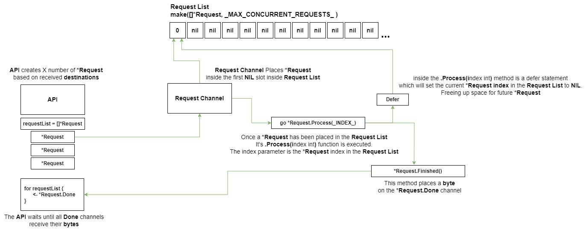

# Delivery Assignment

# Building
 1. Git clone the project to a location of your choosing
 2. Run "go build ." from the root folder of the project. 
 3. NOTE: remember to set the `GOOS` and `GOARCH` environment variables for the architecture you will be deploying the service on.

# Running this service
 1. Place your `.env` file in the same folder as the built binary
 2. Run the binary

# Recommendation
I highly recommend using a service like supervisor to ensure the binary restarts if the server is rebooted/crashes. This is not needed if running inside docker/kubernetes

# Considerations
When tuning the .env variables it is recommended to take into consideration available hardware and software resources. <br>Such as, bandwidth, ephermal ports, available memory, processor speed, etc..


## .Env variables
Documentation on .env variables can be found at the top of main.go
```bash
# Defines the PORT which the web server will be bound to
BIND_PORT=80

# Defines the IP address which the webserver will be bound to
BIND_ADDRESS=0.0.0.0

# Defines how many idle connections we can have.
# NOTE: Idle connections can be re-used by the HTTPClient
MAX_IDLE_CONNECTION=100

# Defines the length of the request queue
# NOTE: It is recommended to set the length of the
#      request queue to be at least 3x the size of
#       MAX_CONCURRENT_REQUESTS
REQUEST_QUEUE_LENGTH=50000

# Defines the request timeout of the initial request call,
# not the timeout to the 3rd party service
API_REQUEST_TIMEOUT_MS=10000

# Defines how many concurrent requests to the
# 3rd party service can be made at a time
MAX_CONCURRENT_REQUESTS=3000

# Defines the request timeout for the 3rd party service
SERVICE_REQUEST_TIMEOUT_MS=10000

# Defines the grace perdiod which each currently active request
# is given to complete before the API shuts down.
API_SERVER_SHUTDOWN_GRACE_PREDOD_MS=1000
```
# Calling the API
## Request 
```bash
curl 'http://<SERVICE_URL>/routes?src=13.388860,52.517037&dst=13.397634,52.529407&dst=13.428555,52.523219&dst=13.428555,52.523219'

# Parameters
#  
# src = The users location 
#     -- Only one src parameter can be defined
#     -- Example: src=13.388860,52.517037
#
# dst = A pickup location
#     -- Multiple dst parameters can be defined
#     -- Example: dst=13.428555,52.523219
# 
```
## Response
```json
{
	"source": "13.388860,52.517037",
	"routes": [{
		"destination": "13.397634,52.529407",
		"duration": 260.1,
		"distance": 1886.3,
		"statusCode": 200, // HTTP status code from the 3rd party service
		"serviceCode": "Ok" // Internal code from the 3rd party service
	}, {
		"destination": "13.428555,52.523219",
		"duration": 389.4,
		"distance": 3804.3,
		"statusCode": 200, // HTTP status code from the 3rd party service
		"serviceCode": "Ok" // Internal code from the 3rd party service
	}]
}
```
## Error Response
```json
{
	"source": "13.388860,52.517037",
	"routes": [{
		"destination": "13.397634,52.529407",
		"duration": 0,
		"distance": 0,
		"error": "Service ratelimit reached", // Error message for none 200 status codes
		"statusCode": 429,
		"serviceCode": ""
	}, {
		"destination": "13.428555,52.523219",
		"duration": 0,
		"distance": 0,
		"error": "Service ratelimit reached", // Error message for none 200 status codes
		"statusCode": 429,
		"serviceCode": ""
	}]
}

```


# Testing
```bash
# This will test the sorting function
$ go test . -v -race -run TestSorting

# This is a single request test
# NOTE: the service needs to be running on 127.0.0.1:80 for it to function
$ go test . -v -race -run TestEndToEnd

# This is a 10x concurrent request test
# NOTE: the service needs to be running on 127.0.0.1:80 for it to function
$ go test . -v -race -run TestEtoEConcurrent
```


# Notes
This service is written in the way I would write it for my own production environment. Keeping in mind that before this service could be considered production ready it would need to be load tested.

# Coding Conventions
Normally I do not follow any coding conventions to the letter. Mostly I just abstract things if functions become too big or if repeate the same code more then once. I am however familiar with a few coding conventions, `Clean Code` being one of them. When joining a team I simply follow whichever coding conventions are being used by that team.

### Git workflow
I normally do not follow basic git workflow conventions when creating the first versions of small services like these.

### Request Validation
No validation is done to ensure that coordinate are actual valid cooridnates. For a high-volume proxy service like this one it's more benefitial to validate the coordinate inputs upstream.

### Simple string returns on 400 and 500 errors
Since users are not interacting dirrectly with this service, a formatted error response for invalid input is not needed. The string error responses are mostly for developers which are developing against the service.

### No rate-limiting on API requests
Since this is designed to be a high-volume proxy layer the implementation of configurable timeouts is (in my experience) better than a ratelimit. If the service is being overloaded it should be scaled horizontally in order to handle the load.

### No rate-limiting to the 3rd party service
I did not implement any rate-limiting for the API calls to the 3rd party service since this particular service is open-source and can be deployed on-premis. My assumption is that this service will be deployed on-premis which means the current rate-limiting mechanism used by the demo environment (http://router.project-osrm.org) will not be a factor.
<br>
<br>
NOTE: There is a small if statement implemented in the Request.Process() method that checks for status code 429. 
```golang
if resp.StatusCode == 429 {
	R.Err = errors.New("Service ratelimit reached")
  return
}
```
This response code might not be a part of the original open-source project but an artifact of the demo environment. If that is the case it can be removed.


<br>
<br>
<br>

# The Routine Monitor Mechanism
The routine monitor is designed to keep goroutines, which are not suppose to exit, running.  
<br>
The `RoutineMonitor` channel and the for loop inside the `main()` function create a circular flow of interger IDs. When a goroutine exits, it returns an ID to the `RoutineMonitor` channel, which is read by the for loop inside `main()`, which re-launches the appropriate goroutine.


<br>
<br>

# The Queue Mechanism

<br>
<br>
The queue mechanism has three main components
```golang

RequestSlice []*Request
RequestSlice = make([]*Request, MAX_CONCURRENT_REQUESTS)

RequestQueue chan *Request
RequestQueue = make(chan *Request, REQUEST_QUEUE_LENGTH)


type Request struct {
	Src      string
	Dst      string
	Type     string
	Resp     *DestinationServiceResponse
	Err      error
	HTTPCode int
	Done     chan byte
	CTX      context.Context
}
```
The `RequestSlice` holds a finite number of pointes to `Request`. This finite number controls how many concurrent requests we can have at any given moment. 

<br>
<br>

Each call to the API `/routes` can contain multiple coordinate destinations. Each of these destianations is turned into a `Request` objects and placed in the `RequestQueue`. Once all coordinate destinations have been place in the `RequestQueue` the function waits for all `Request.Done` channels to return a `byte`.

```golang
for i := range requestList {
	select {
	case <-requestList[i].Done:
	case <-Timeout:
		cancel()
		return nil, errors.New("Request timeout")
	}
}
```
<br>

The `RequestQueue` allocates `Request` pointers into the `RequestList` and then calls the `Requests Process()` method, giving it the `RequestList` index as a parameter.

```golang
for {
  for i := range RequestSlice {
    if RequestSlice[i] == nil {
      RequestSlice[i] = <-RequestQueue
      go RequestSlice[i].Process(i)
    }
  }

  time.Sleep(1 * time.Millisecond)
}
```
<br>

Once the `Process` method complets it does two things:

 - Call the `Finished()` method. This method places a `byte` in the `Done` channel, effectialy marking the request done.
 - Setting the `RequestList` index to `nil`, freeing up space for `Requests` waiting in the `RequestQueue`

Once all `Requests` have been completed or timed-out all that's left to do is sort the data and construct the response.
 